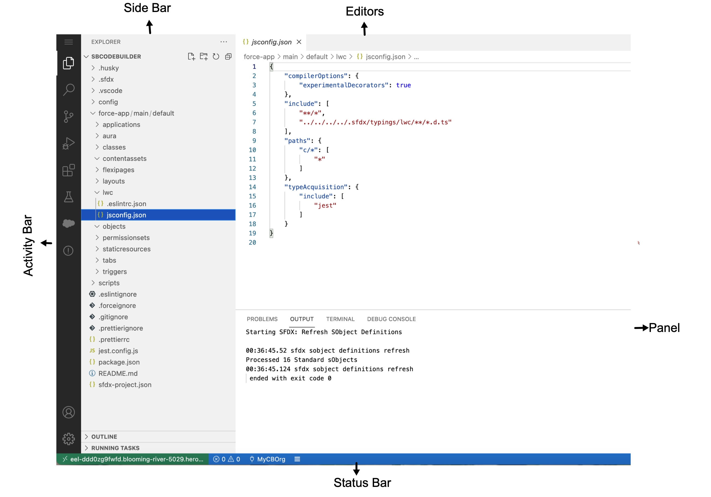
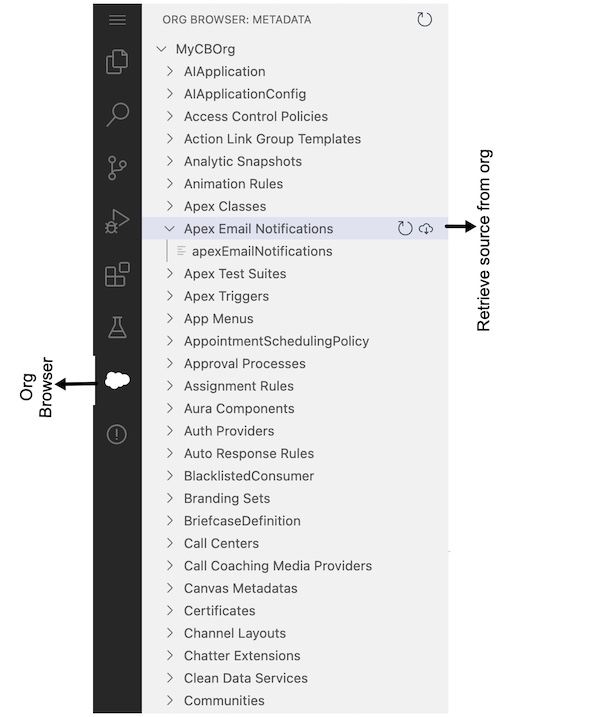

## Overview
Complete this Quick Start to become familiar with the Code Builder interface and perform some simple tasks in your Code Builder environment.
## Important Considerations for Code Builder Beta
We've capped usage for beta at 20 hours for a maximum of 30 days. We highly recommend that you save your work and close the browser tab that is running Code Builder to stop the usage clock when you aren’t using Code Builder.

### Don’t Forget to Save Your Work
Working in the cloud has its advantages. There are some differences though. Unlike working on a desktop where you save your files to a local machine, you must either deploy your changes to your org, or commit them to source control to save your work. Remember to do this before you close the Code Builder tab on your browser so you don’t lose your work.  Throughout the beta, Code Builder environments could be deleted.  All beta environments will be removed before GA.


## Let’s Get Started
To get started you’ll do the following:
1. Create a Code Builder Environment.
2. Create a Salesforce DX project.
3. Connect to your Org by logging in.
4. Now you’re ready to use Code Builder.

## Connect to Your Dev Environment
1. From the App Launcher, find and open **Code Builder**.
(If you don't see Code Builder as an option, or you see an empty screen when you launch it, contact your admin to make sure you have the correct license and permission set assigned to you.)
2. Start setting up your Code Builder environment. Click “Get Started”.
3. Click “New Project to create a new Salesforce DX project.
4. Give your project a name and choose “Standard” for project type.

Following steps involve connecting an Org to your Code Builder environment. You can choose to connect to a Salesforce Org (`login.salesforce.com`) or a Sandbox Org (`test.salesforce.com`).

1. Go through the standard Salesforce login rituals and give Code Builder access to your org. Click **Allow**.
2. After you’ve successfully connected to your org, click **Next**.
3. Choose an alias (nickname) for your org. If you work on many orgs, make sure the nickname helps you identify the org quickly in the future. 
4. Your new Code Builder environment is now available on your dashboard.
5. Click **Launch** to launch Code Builder in a new tab. 
6. Now sit back and relax for a few minutes while Code Builder creates and configures your workspace. Code Builder might take a minute (well, currently  x-y minutes) to start up when it initially sets up.

**Tip**: Once you have created your Code Builder environment, just Launch your Code Builder environment from the dashboard at any time, or bookmark it for fast access.

## Let's Take A Quick Tour
You’re now in your developer environment in Code Builder. Code Builder has VS Code’s rich IDE plus it gives you easy access to cool Salesforce development-specific tools through the Salesforce extension pack. Let’s take a quick tour and get to know the lay of the land. Your screen looks something like this:


The Code Builder user interface is divided into five main areas.

**Activity Bar**: Located on the left-hand side and it contains iconic buttons to switch between different views. For instance, the Explorer view is active in the above picture.
**Side Bar**: Contains different views like the Explorer to assist you while working on your project. For example, you can see the Explorer view active in the above image which lists the files in a file structure of your project.
**Editors**: The main areas to edit your files. You can open as many editors as you like side by side, vertically and horizontally.
**Panel**: Shows output or debug information, errors and warnings, or an integrated terminal. You can choose the output you want to display.
**Status Bar**: Shows information about the opened project and the files you’re editing. This is where you can also see the org you’re working against. 

## Get To Know Your Org – Use the Org Browser
Take a closer look at the activity bar and notice a cloud icon. This is the Org Browser. It’s a part of the Salesforce Extension Pack. It helps you browse and retrieve metadata from your org without having to use a manifest file. The Org Browser is available only in non source-tracked orgs such as sandboxes or developer edition orgs. You can retrieve the metadata source into your local project. 

**More Information**: You can find more information about the [Org Browser](https://developer.salesforce.com/tools/vscode/en/user-guide/org-browser) in the Salesforce Extension Pack documentation.




Click Org Browser and scroll down to **Custom Objects**. The first object you see is Account. You can view the metadata of the **Account** object (and do a few more cool things, but we’ll get to those in a bit). 

## Use SOQL Builder to Build and Run your First Query

Code Builder comes preloaded with everything you need, to build and run a SOQL query as a part of the Salesforce extension pack. 

Let’s build and run a simple SOQL query on the Account object:

1. Press Ctrl+Shift+P (⇧⌘P)  to view the command palette.
2. Type “SOQL” in the search box and then select the **SFDX: Create Query in SOQL Builder** command.
3. Select  the following:

    a. **Account** Object in **From** field.

    b. **BillingState** and **NumberofEmployees** in **Fields**.

    c. Press **Run Query** to run this simple SOQL Query on your org.

You’re prompted to save your changes if you close the untitled file. 
5. Save the changes to a file using a “.soql” extension.
6. Let’s rerun the saved query – Right click the file and select **Open With…** then select SOQL Builder.
The file opens in SOQL Builder and you can rerun or edit the query as you wish.

**More Information**: For more information about building complex queries and much more see the  [SOQL Builder](https://developer.salesforce.com/tools/vscode/en/soql/soql-builder) in the Salesforce Extensions for Visual Studio Code documentation.

## Connect to a Different Org
During the course of development, you'll use different types of orgs for different stages. For example, it's common to use a Developer sandbox or Development Edition org during the development phase, and move to other sandbox types for integration, testing, and staging. Eventually, you'll deploy your changes to a production org. You can connect Code Builder to any of these orgs to deploy or retrieve metadata.

To log into an org:

1. From the command palette run **SFDX: Authorize an Org**.
2. Select either sandbox for the login URL (`test.salesforce.com`) or a developer org if you have access to one.
3. Enter an alias for the org, for example, dev_pro_sandbox or my_playground.
4. Log in with the relevant username and password.
5. You’re now connected to your org, and its name is visible in the status bar at the bottom.
6. Once you authorize an org, we create a connected app that takes care of future authorizations so you don't have to continually log in. Just click the org’s name and then choose the previous org from the list.	

## Create, Retrieve, and Deploy a Custom Field
Let’s add a custom field to an object in our org and pull its metadata into our Code Builder project.

First let’s add a custom field  – 

1. From **Setup**, go to **Object Manager | Account**.
2. Click **Fields & Relationships**.
3. Click **New**.
4. For data type, select **Date**, then click **Next**.
5. Fill out the following:
     * Field Label: Created On
     * Field Name: createdon
     * Description: Date of Account Creation
6. Click **Next** until you save the field.

Now let’s retrieve metadata for this new field –

1. Return to Code Builder and click the Org Browser
2. Scroll down to **Custom Objects** and navigate to **Account**
3. Click the retrieve icon next to the Account component to run **SFDX: Retrieve Source from Org**
4. From the Activity Bar, click the Explorer and navigate to `force-app/main/default/object/Account`
Lo and behold, in the `fields` folder, a file named `createdon_c.field-meta.xml` contains metadata for your new custom field! 

The metadata is here for your reference:
```
<?xml version="1.0" encoding="UTF-8"?>
<CustomField xmlns="http://soap.sforce.com/2006/04/metadata">
   <fullName>createdon__c</fullName>
   <description>Date of Account Creation</description>
   <externalId>false</externalId>
   <label>Created On</label>
   <required>false</required>
   <trackFeedHistory>false</trackFeedHistory>
   <type>Date</type>
</CustomField>
```
We’ll now make a simple edit to this field and deploy our changes back to our org with a single click.

1. Edit `createdon_c.field-meta.xm`l and change the `<required>` tag value to `true` to indicate that you want this custom field to be a required field. 
2. Right click the `objects/Account` folder and click **SFDX: Deploy Source to Org** 
3. After the command has successfully run, go back to your org and check details of the **Created On** custom field and confirm that it’s now a required field. 

## Create and Deploy a New Lightning Web Component
For another exercise in deploying, let’s learn how to quickly create a simple Lightning Web Component in our Code Builder project. We’ll then deploy this component to our org using a single command. Here we go:

Let’s create a Lightning Web Component – 

1. Press Ctrl+Shift+P (⇧⌘P) run **SFDX: Create Lightning Web Component** to create a New Lightning Web Component. 
2. Give the component a name, say, `newCBComponent`.
3. Press Enter to accept the default file location (`force-app/main/default/lwc`).
4. Press Enter.

Three new files are created in the `force-app/main/default/lwc/newCBComponent` folder.

Update the files –

1. In the HTML file, `newCBComponent.html`, copy, and paste the following code:

```
<template>
    <p>Hello, {greeting}!</p>
    <lightning-input label="Name" value={greeting} onchange={handleChange}></lightning-input>
</template>
```
2. In the HTML file, `newCBComponent.js`, copy, and paste the following code:

```
import { LightningElement } from 'lwc';

export default class NewCBComponent extends LightningElement {
   greeting = 'Great going learning Code Builder!';
   changeHandler(event) {
       this.greeting = event.target.value;
   }
}
```
3. In the HTML file, `newCBComponent.js-meta.xml`, copy, and paste the following code:
```
<?xml version="1.0" encoding="UTF-8"?>
<LightningComponentBundle xmlns="http://soap.sforce.com/2006/04/metadata">
   <apiVersion>54.0</apiVersion>
   <isExposed>true</isExposed>
   <targets>
   <target>lightning__AppPage</target>
   <target>lightning__RecordPage</target>
   <target>lightning__HomePage</target>
 </targets>
</LightningComponentBundle>
```
4. Save all the files.

Let’s deploy this new component to our org – 

1. Right-click the `force-app/main/default/lwc/newCBComponent` folder and click **SFDX: Deploy Source to Org** 

Your output window and shows this message:

```

=== Deployed Source
STATE    FULL NAME       TYPE                      PROJECT PATH                                                       
───────  ──────────────  ────────────────────────  ────────────────────────────────────────────────────────────────────
Created  newCBComponent  LightningComponentBundle  force-app/main/default/lwc/newCBComponent/newCBComponent.html      
Created  newCBComponent  LightningComponentBundle  force-app/main/default/lwc/newCBComponent/newCBComponent.js        
Created  newCBComponent  LightningComponentBundle  force-app/main/default/lwc/newCBComponent/newCBComponent.js-meta.xml

10:22:27.340 ended SFDX: Deploy Source to Org

```
2. Select **SFDX: Open Default Org** to log into your org.
3. Navigate to **Setup:Lightning Components** to confirm that a new lightning component named `newCBComponent` is now available in your org. 


Congratulations on successfully creating and deploying a new Lightning Web Component.

## To Learn More
You can take your time and use these resources to learn more about what you can do in Code Builder:

* [Visual Studio Code User Interface](https://code.visualstudio.com/docs/getstarted/userinterface) to get to know the Visual Studio code user interface 
* [Salesforce Extensions](https://developer.salesforce.com/tools/vscode) to learn about all the powerful features of the Salesforce Extension for VS Code. 